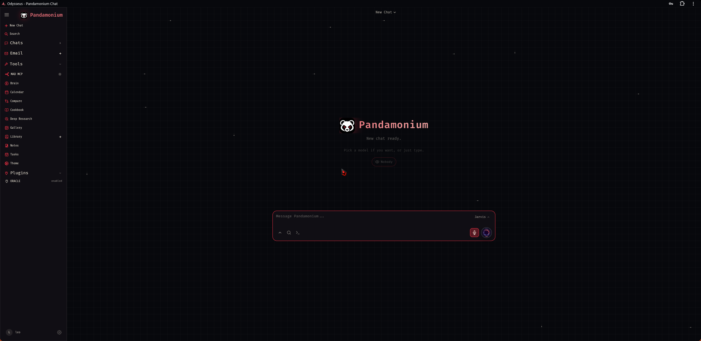
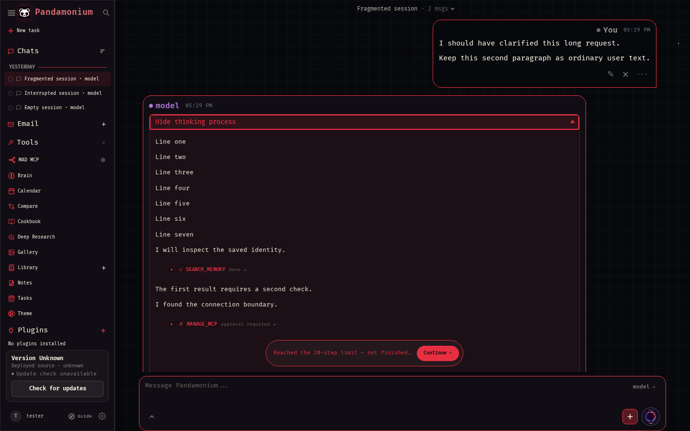
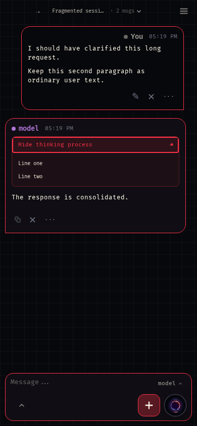
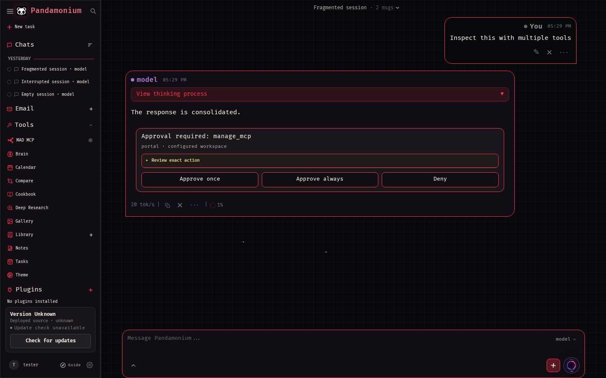
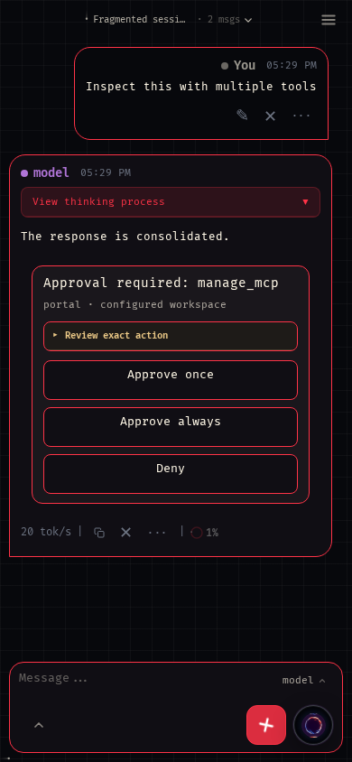
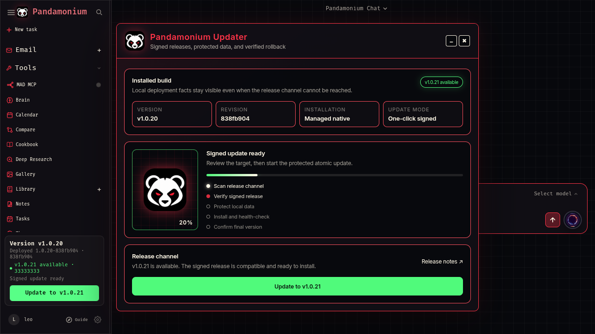
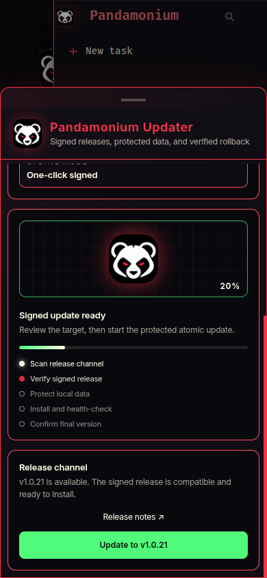

<h1 align="center">Pandamonium</h1>

<p align="center">
  <strong>Your self-hosted AI control plane.</strong><br>
  Local and API models, agents, voice, memory, tools, documents, and extensions in one workspace.
</p>

<p align="center"><sub>Maintained by MADPANDA3D.</sub></p>

<p align="center">
  <a href="#quick-start">Quick Start</a> ·
  <a href="#pandamonium-upgrades">Upgrades</a> ·
  <a href="docs/setup.md">Setup Guide</a> ·
  <a href="docs/voice-orb/README.md">Voice Orb</a> ·
  <a href="CONTRIBUTING.md">Contributing</a> ·
  <a href="ROADMAP.md">Roadmap</a>
</p>

<p align="center">
  
</p>

## Quick Start

```bash
git clone https://github.com/MADPANDA3D/Pandamonium.git
cd Pandamonium
cp .env.example .env
PANDAMONIUM_SOURCE_REVISION="$(git rev-parse HEAD)" docker compose up -d --build
```

Open `http://localhost:7000` after the containers become healthy. The first
admin password is printed by:

```bash
docker compose logs pandamonium
```

Native Linux, macOS, Windows, GPU, HTTPS, and configuration instructions are
in the [setup guide](docs/setup.md).

## Pandamonium Upgrades

Pandamonium keeps Odysseus's self-hosted workspace foundation and adds the
following maintained platform capabilities.

### Model-neutral identity and chat

- Installation-owned agent name, ID, constitution, and version instead of a
  model-owned persona.
- Guided first-run setup for identity, model endpoints, and integrations.
- Exact runtime model reporting: the agent reports the configured model
  identifier without inventing a vendor or claiming to be GPT.
- One adaptive conversation flow that keeps ordinary chat lightweight and
  brings in tools only when the request needs them.
- Local and API model support through configurable endpoints, with model
  switching that does not replace the agent's identity, memory, or sessions.
- One owner-visible selector classifies inference models, conversational agents,
  and execution workers from the same live discovery and health data in chat
  and voice, including explicit unavailable states without silent rerouting.
- The server persists each conversation target. The left sidebar follows that
  target: conversational identities show only their dated chats, while a Codex
  worker shows its allowlisted projects with tasks loaded beneath each project.
- Pins, project/chat ordering, and five-row **Show more** are shared sidebar
  behavior for all configured agents and catalog workers. Visible drag handles
  support pointer/touch reordering; **Alt + Up/Down** moves focused rows.
  The signed-in owner's preferences preserve each worker's layout independently.
  The local Codex catalog retains its desktop layout seed. Reordering never
  changes a task's project or execution directory.
- The rounded conversation picker, effort control, and Details card follow the
  active Pandamonium theme. Assigned identity names remain separate from runtime
  and configured node labels. Tailnet discovery probes selected nodes for model
  endpoints; installed Codex/Claude capabilities come from configured bridges,
  not from detecting arbitrary bare CLI installations.
- Selecting a native Codex task loads its recent conversation. **Load earlier messages**
  pages older turns. Commentary and tool activity collapse under **Worked**; the
  final answer stays visible. Desktop-owned tasks continue through their existing
  owner; active turns accept steering. Compact model/effort choices apply to the next turn.
  Task selection survives reload. Update the selected [Codex bridge](services/pc-codex-bridge/README.md)
  together with Pandamonium for native history support.
- Pasted web links appear as the same compact link chips in the composer and sent
  messages. Copying/submitting preserves the full URL; double-click a chip to edit
  its URL. Plain-text paste, multiline drafts, and native undo/redo stay available.
- **Details** keeps essential environment rows, three source previews, and short
  tool/output previews compact. **View all** opens a themed sliding panel and
  progressively reads earlier activity. Full paths remain available there; attachment
  binaries stay on their originating node. Branch/model metadata is recorded state.
- The model picker uses Codex's supported native reasoning efforts. The model-backed agent's
  **Agent work budget** controls maximum model/tool rounds: Low 20, Medium 40,
  High 80, Very high 120, Maximum 200. Reset uses the installation default (80).
  The previous saved default of 20 upgrades to 80 once; other custom caps remain.
  After upgrading, saving 20 explicitly retains that lower cap.
  These are caps for the next text turn, not required loops or an intelligence
  setting: successful completion stops early and authority/verification gates
  still apply. Voice keeps its existing budget.
- Tool-using assistant turns keep visible reasoning, status, and tool activity
  in one chronological disclosure above the final answer. The disclosure is
  collapsed after completion, expands in the page flow without a nested scroll
  region, and remains keyboard-accessible after reopening a saved conversation.

Native history and Details demo views: [compact card](docs/screenshots/workspace-history-desktop.png),
[full sources](docs/screenshots/workspace-sources-desktop.png), and
[phone panel](docs/screenshots/workspace-sources-mobile.png).

Workspace controls: [desktop preview](docs/screenshots/workspace-shared-desktop.png)
and [mobile preview](docs/screenshots/workspace-shared-mobile.png).
Earlier native Codex views: [desktop](docs/screenshots/workspace-context-desktop.png)
and [mobile](docs/screenshots/workspace-context-mobile.png).





### Governed agents, tools, and extensions

- Built-in tools, MCP servers, skills, files, shell, web, and browser-facing
  foreground actions behind owner, permission, approval, and evidence gates.
- An optional backend-only external coding-agent bridge exposes authenticated,
  owner- and Workspace-scoped catalog/event/transcript reads plus governed task
  start, steer, reply, status/resume, and cancellation. It remains absent until
  an operator configures an exact versioned endpoint, credential-file reference,
  network policy, Workspace allowlist, and per-action capability/effect allowlist.
- Native MCP connections route through their live handshake, catalog, and exact
  typed tool schemas instead of guessed REST paths or duplicate API identities.
- Broker-style servers remain ordinary native MCP connections: Pandamonium
  exposes the tools and workflow instructions they declare, validates their
  exact schemas, and forwards the selected tool name and arguments unchanged.
  It does not import downstream catalogs or synthesize provider-specific proxy
  tools. Read-only calls require no approval, while effectful calls continue
  through the shared authority gates.
- Approval cards offer deny, approve once, and explicit narrow approve-always;
  persistent receipts remain inspectable and revocable, while target or argument
  changes require a new decision.





- Jarvis OS protocol coverage for identity, bounded context, memory provenance,
  action envelopes, authority receipts, learning controls, and operational
  traces. See the [runtime status](docs/jos-protocol-runtime-status.md).
- Generic extension manifests, installed-plugin visibility, pinned Git source
  installation, capability registration, enable/disable lifecycle, and
  rollback without giving extensions authority over the host.
- Signed plugin marketplace discovery and approval-gated install, update,
  enable/disable, rollback, and recoverable removal through the native lifecycle.
- Scoped client-state and foreground-action bridges for extensions that need
  to interact with the active browser surface.
- ORACLE remains an optional reference extension; clean installations start
  without private extensions, workers, credentials, or topology.

### Knowledge and workspaces

- Owner-scoped long-term memory and document RAG with source provenance,
  compaction, prompt-injection boundaries, and optional Graphify code graphs.
- Owner-scoped Books library with PDF ingestion, page-aware retrieval, source
  attribution, reindexing, deletion, and bundled Tesseract OCR for scanned PDFs.
- Documents, attachments, email, notes, tasks, calendar and CalDAV, gallery,
  Deep Research, model comparison, and the hardware-aware model Cookbook.
- Pandamonium branding, configurable themes, and authenticated preference sync
  across browser sessions.
- Integration inventory distinguishes configured services from services that
  have actually passed a live health check.

### Voice Orb and workers

- Integrated microphone, STT, TTS, interruption, and streamed spoken responses
  that preserve the complete written answer while sanitizing speech-only text.
- Setup diagnostics for the selected model, speech providers, and optional
  worker readiness.
- Explicit, user-initiated camera frames and checksummed same-origin media;
  camera frames are bounded and are not persisted.
- Optional concurrent read-only worker adapters with attributed progress,
  cancellation, session reconstruction, health gates, and disabled-by-default
  configuration.
- The optional PC Codex bridge exposes only installation-allowlisted projects
  and owner-safe task metadata through supported Codex App Server APIs, with
  exact resume, create, steer, cancel, progress, and cited artifact handoff.
  See the [Voice Orb documentation](docs/voice-orb/README.md).

### Reliability, deployment, and security

- Context budgets use the model server's effective allocated capacity, with
  bounded tool schemas, trimming, and compaction for smaller local models.
- Automatic memory work runs in the background, and tool-backed turns include
  a guarded final-answer recovery path instead of returning an empty result.
- Owner-scoped authentication, sessions, data, integrations, API tokens,
  backups, and restore paths for shared or proxied installations.
- Docker Compose, native Python, and systemd workflows; canonical
  `pandamonium` CLI, service, package, environment, and GHCR naming.
- Required pytest, browser, syntax, Compose, secret, dependency, workflow, and
  container security checks on the canonical `main` branch.
- Legacy `odysseus` commands and `ODYSSEUS_*` environment variables remain as
  documented compatibility aliases so existing installations can upgrade.

## Command Line

The canonical command is `pandamonium`:

```bash
./scripts/pandamonium help
./scripts/pandamonium backup snapshot
./scripts/pandamonium update check
./scripts/pandamonium update status
./scripts/pandamonium mcp list
```

Managed native Linux installs can enable signed, checksummed updates from the
fixed footer. **Check for updates** opens a release-control panel that keeps the
installed version, exact revision, installation type, and GitHub release check
as separate facts. During an update it keeps the backup and phase visible,
reconnects across the expected service restart, and confirms the newly running
version without requiring a manual page refresh. Each install stages an
immutable release, verifies a full data backup, rehearses idempotent migrations,
atomically switches `current`, and automatically restores the prior release and
data if health checks fail. See
[Atomic native Linux updates](docs/setup.md#atomic-native-linux-updates).

Docker, ordinary source checkouts, macOS, and Windows still use their platform's
normal upgrade procedure; the footer reports that host-managed updates are
required instead of attempting an in-container or in-checkout mutation. Official
GHCR images embed their exact source revision. Source-built Docker installs can
preserve the same provenance by passing `PANDAMONIUM_SOURCE_REVISION` during the
Compose build, as shown in the setup guide.





The former `odysseus` command names remain as compatibility aliases for
existing installations. New configuration uses `PANDAMONIUM_*` environment
variables; the former `ODYSSEUS_*` names remain accepted during migration.

## Security

Pandamonium exposes powerful local tools. Keep authentication enabled, keep
private data and credentials out of Git, and do not expose raw model or service
ports publicly. See [SECURITY.md](SECURITY.md) and the
[deployment guidance](docs/setup.md#security-notes).

## Star History

<a href="https://www.star-history.com/?repos=MADPANDA3D%2FPandamonium&type=date&legend=top-left">
  <picture>
    <source media="(prefers-color-scheme: dark)" srcset="https://api.star-history.com/chart?repos=MADPANDA3D/Pandamonium&type=date&theme=dark&legend=top-left&sealed_token=1p4_3IuUF5yfOSHwneNKxDToQM9CQZ-ZEqbi1EgfQBPHJM7gAqAZkZOJ4WgXmFh8pqsWLxCh_8FfTp1_hIHJ0TJNxxtP9PrLYPCClMr2Qy7Yw92nH6xAA23n6Zp3Rq_ZSIvQ9TnfuLFdUvCG11ITzZ7Co85qN1jWEm1j7RLCwCqVjKENVwjsmEUSYUdC">
    <source media="(prefers-color-scheme: light)" srcset="https://api.star-history.com/chart?repos=MADPANDA3D/Pandamonium&type=date&legend=top-left&sealed_token=1p4_3IuUF5yfOSHwneNKxDToQM9CQZ-ZEqbi1EgfQBPHJM7gAqAZkZOJ4WgXmFh8pqsWLxCh_8FfTp1_hIHJ0TJNxxtP9PrLYPCClMr2Qy7Yw92nH6xAA23n6Zp3Rq_ZSIvQ9TnfuLFdUvCG11ITzZ7Co85qN1jWEm1j7RLCwCqVjKENVwjsmEUSYUdC">
    
  </picture>
</a>

## Project Lineage

Pandamonium began as a fork of
[Odysseus](https://github.com/pewdiepie-archdaemon/odysseus) and retains the
original project history, contributor attribution, and AGPL license. It is an
independent MADPANDA3D project, not an official Odysseus release. Details are
recorded in [NOTICE](NOTICE) and [ACKNOWLEDGMENTS.md](ACKNOWLEDGMENTS.md).

## License

AGPL-3.0-or-later — see [LICENSE](LICENSE), [NOTICE](NOTICE), and
[ACKNOWLEDGMENTS.md](ACKNOWLEDGMENTS.md).
