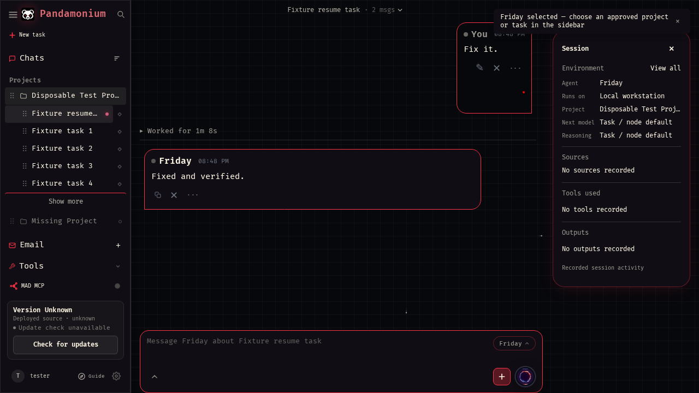

# Pandamonium agent gateway

Pandamonium adds interface context, attachments and authorized tools to a native
agent. Codex and Hermes retain their own instructions, tools, history and settings.
They do not need to run inside the Pandamonium container.

Each direct chat turn carries its Pandamonium session, selected presenter,
workspace, attachment manifest and an opaque gateway context reference. The MCP
gateway exposes `read_context`, `discover`, `read_tool` and `execute` using the
existing tool schemas, extension bridge, tool runner and authority service.
`read_tool` rejects any action that is not proven read-only. `execute` retains
both native-client approvals and Pandamonium authorization; a denied or pending
action has not run. Nothing routes through Jarvis's model as an intermediary.

## Connect a native runtime

Set the existing `APP_PUBLIC_URL` to the installation's HTTPS origin. The gateway
is `/api/agent-gateway/mcp/` and accepts the existing private agent bridge bearer
token (`ODYSSEUS_AGENT_BRIDGE_TOKEN_FILE`), not browser cookies or general chat
API tokens. Token and context reference together authorize the originating
session; keep the connection private. Session ownership is rechecked on each call.

After updating Pandamonium, run the workstation bridge's setup command:

```sh
python jarvis_codex_bridge.py --configure-gateway https://your-pandamonium-host/api/agent-gateway/mcp/
```

The command uses `JARVIS_CODEX_BRIDGE_TOKEN_FILE`, verifies the endpoint without
following redirects, and adds only `mcp_servers.pandamonium` through Codex's
native configuration API. It refuses to overwrite a different connection and
checks that other settings remain intact. Codex stores the authentication header
in its private `config.toml`; never commit or share that file.

Reload MCP connections or restart Codex Desktop once after adding the connection.
Already-open tasks retain their IDs and history; an already-loaded Desktop
runtime does not pick up the new connection merely because the file changed.
Other MCP-capable agents can use the same Streamable HTTP endpoint and bearer
header through their native connection configuration. Their approval rules still
apply. Desktop-owned tasks display approvals in Codex. A headless bridge task
that requests native approval stops visibly and must be continued in Codex; the
bridge never grants or suppresses that approval. Merely forwarding the context text does not install callable tools.

Context references expire after 24 hours, an application restart, or eviction
from the 1,024 most recent turns. Sending a new
message through Pandamonium renews context. The gateway remains unavailable to
anonymous callers even when the normal app login middleware is bypassed for its
MCP transport.

## Images and presentation

Pandamonium resolves uploads against the sending user, validates image bytes,
and forwards native images directly to Codex or OpenAI-compatible Hermes input.
It does not run those images through the local model first. Up to 12 images and
15 MiB total are accepted per turn. The standalone Codex bridge stages private
local image files, including for active-turn steering; it rejects caller-supplied
workstation paths and remote image URLs.

Private workstation history is available only to the installation operator
(admin or explicitly configured single-user mode), not other app accounts.
Native history returns actual bytes for exact recorded local image references
only after verifying task/project membership. Each history page has a 15 MiB
image budget. Missing, unsupported or oversized images show an explicit
unavailable message. Image previews open the existing attachment lightbox.
Final responses use normal chat bubbles; commentary and tool activity stay under
the collapsed Worked disclosure.

The browser regression fixture shows the restored Friday bubble and collapsed
Worked activity (the tiny red square is the image decoding fixture):


