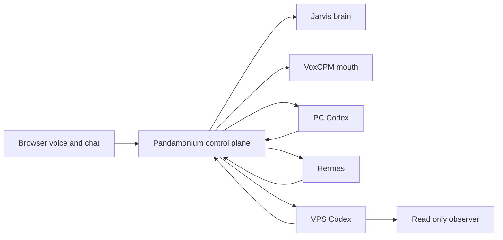

# Mark 6 Agent Mesh Threat Model

## Executive summary

Mark 6 connects a browser voice surface to sensitive local sessions and three code-capable workers. The highest risks are worker credential theft, workspace/path boundary bypass, privileged-observer expansion, and untrusted worker output becoming spoken or persisted operator context. Existing bearer auth, fixed workspace aliases, canonical artifact checks, disabled-by-default remote adapters, and a read-only Unix-socket observer materially reduce risk. Worker rate limiting and credential rotation remain the main hardening gaps.

## Scope and assumptions

- In scope: `routes/voice_routes.py`, `routes/agent_task_routes.py`, `src/jarvis_agent.py`, `src/agent_worker_adapters.py`, `static/js/jarvisVoice.js`, and `services/` worker code.
- Intended for one trusted operator over a private tailnet; no multi-tenant or public worker access.
- Business files, client operations, system state, worker credentials, and Codex/Hermes threads are sensitive.
- Model and worker text are untrusted data. They never authorize a mutation by themselves.
- Raw microphone audio is out of scope because Mark 6 does not persist it.

## System model

### Primary components

- Pandamonium browser: microphone capture, live chat rendering, audio playback, active-agent control.
- Pandamonium API: authenticated voice sessions, task broker, durable events, document persistence, policy.
- Jarvis brain and mouth: Qwen generation followed by VoxCPM PCM synthesis.
- PC, Hermes, and VPS workers: independently authenticated adapters with durable thread/session bindings.
- VPS observer: root-owned fixed read-only commands over a group-restricted Unix socket.

### Data flows and trust boundaries

- Browser -> Pandamonium: transcript/audio state over authenticated HTTPS; schema validation and owner checks apply.
- Pandamonium -> brain/TTS: prompts and assistant text over private service links; one TTS inference lock limits GPU contention.
- Pandamonium -> workers: prompts, workspace aliases, permissions, and thread IDs over bearer-authenticated private HTTP/SSE.
- Workers -> Pandamonium: untrusted normalized events, final text, questions, approvals, and bounded document artifacts.
- VPS Codex -> observer: fixed action name and allowlisted target over a filesystem-permissioned Unix socket.

#### Diagram

## Assets and security objectives

| Asset | Why it matters | Objective |
| --- | --- | --- |
| Worker bearer credentials | Permit task/event/control access | C, I |
| Client and workspace files | Contain private business data and source | C, I |
| Pandamonium sessions/documents | Durable operator context and artifacts | C, I, A |
| Codex/Hermes thread bindings | Preserve agent continuity and authority | C, I |
| VPS observer socket | Crosses into root-readable system facts | C, I |
| GPU voice/brain services | Required for timely call interaction | A |

## Attacker model

### Capabilities

- A compromised tailnet peer can reach advertised private ports permitted by tailnet ACLs.
- A model or worker can return malicious text, metadata, paths, or repeated events.
- A stolen bearer token can be replayed until rotated.

### Non-capabilities

- No worker port is intentionally public and Tailscale Funnel is disabled.
- The unprivileged VPS worker has no sudo or Docker group membership.
- Models cannot choose arbitrary server paths or convert a read-only task into approval.

## Entry points and attack surfaces

| Surface | Trust boundary | Controls | Evidence |
| --- | --- | --- | --- |
| Agent task API | Browser to broker | Authenticated owner checks and Pydantic schemas | `routes/agent_task_routes.py` |
| Worker adapters | Broker to remote workers | Separate token files, disabled defaults, health gates | `src/agent_worker_adapters.py` |
| Worker SSE events | Worker to broker/browser | Normalized event types and durable local sequence | `src/jarvis_agent.py` |
| Artifact marker | Codex to document store | Canonical workspace containment, suffix and size checks | `services/pc-codex-bridge/jarvis_codex_bridge.py` |
| Voice playback stream | API to browser audio | One speech coordinator and one TTS lock | `routes/voice_routes.py` |
| VPS observer | Unprivileged worker to root facts | Unix group, fixed actions, service allowlist, no shell | `services/vps-worker/jarvis_vps_observer.py` |

## Top abuse paths

1. Steal a worker token, create tasks, and read event/results from an allowed workspace.
2. Coerce Codex into emitting an artifact path outside its workspace and attempt document exfiltration.
3. Forge repeated progress or approval events to mislead or exhaust the spoken queue.
4. Abuse an observer parameter to turn a fixed root command into arbitrary command execution.
5. Flood brain/TTS/task endpoints to keep GPUs and worker processes busy.
6. Misconfigure Tailscale Serve/Funnel or bind a worker to a public interface, expanding exposure.

## Threat model table

| ID | Threat | Existing controls | Gap and mitigation | Likelihood | Impact | Priority |
| --- | --- | --- | --- | --- | --- | --- |
| TM-001 | Worker token theft and replay | Per-worker token files; private links; owner-bound broker tasks | Add rotation runbook, short token audit events, and tailnet ACL source restrictions | Low | High | High |
| TM-002 | Workspace/artifact path escape | Server aliases; `resolve()` plus `relative_to()`; text suffix and 2 MB cap | Add symlink-race regression and optional file hash/source audit | Low | High | High |
| TM-003 | Malicious worker output is spoken or persisted | Event allowlist; raw tools silent; final result stored once | Sanitize artifact metadata and cap/dedupe every event class server-side | Medium | Medium | Medium |
| TM-004 | VPS observer command injection or privilege escalation | Fixed functions, list-form subprocesses, service allowlist, Unix group, no sudo/Docker | Keep mutation API absent until separate review; alert on denied observer targets | Low | High | High |
| TM-005 | GPU/task denial of service | One TTS inference lock; worker runtime cap; progress coalescing | Add per-session task limits, request body rate limits, and queue depth metrics | Medium | Medium | Medium |
| TM-006 | Accidental public exposure | Tailnet-only Serve; Funnel disabled; remote adapters disabled by default | Add startup assertions rejecting wildcard/public worker binds and monitor Serve config | Low | High | High |

## Criticality calibration

- Critical: unauthenticated public worker execution, arbitrary root observer command execution, or cross-workspace secret exfiltration.
- High: stolen worker credentials, artifact containment bypass, or accidental public binding.
- Medium: authenticated queue exhaustion, misleading progress injection, or partial task-history disclosure.
- Low: non-sensitive worker metadata leakage or noisy failed connection probes.

## Focus paths for security review

| Path | Why it matters | Threats |
| --- | --- | --- |
| `src/agent_worker_adapters.py` | Remote auth and event normalization boundary | TM-001, TM-003, TM-006 |
| `src/jarvis_agent.py` | Task ownership, persistence, bindings, and artifacts | TM-002, TM-003, TM-005 |
| `routes/agent_task_routes.py` | Public task/action authorization surface | TM-001, TM-005 |
| `routes/voice_routes.py` | GPU queue, state, and orchestration surface | TM-003, TM-005 |
| `services/pc-codex-bridge/jarvis_codex_bridge.py` | App Server process and file boundary | TM-002, TM-005 |
| `services/vps-worker/jarvis_vps_observer.py` | Root privilege boundary | TM-004 |
| `static/js/jarvisVoice.js` | Spoken queue and operator approval UI | TM-003 |
