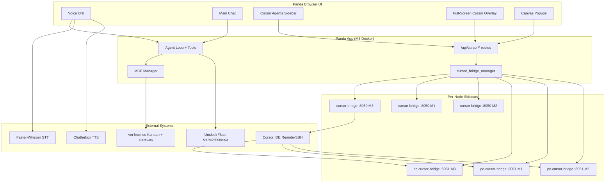

# Pandamonium — Work Summary

**Scope:** Everything added to the Pandamonium app on the labs247 / Twenty4SevenLabs fork, from the original upstream v1.0.5 baseline through the current `cursor-bridge` branch (including uncommitted canvas-relay work).

**Baseline:** [MADPANDA3D/Pandamonium](https://github.com/MADPANDA3D/Pandamonium) v1.0.5  
**Current branch:** `cursor-bridge`  
**Canonical fork:** [Twenty4SevenLabs/Pandamonium](https://github.com/Twenty4SevenLabs/Pandamonium)

---

## ELI5 — Brief Summary

**Pandamonium is your home AI control panel.** We took the open-source Pandamonium app and wired it up for Jason's lab: multiple Mac/Proxmox machines, a voice assistant orb, task boards, and Cursor IDE agents — all in one browser UI.

In plain terms, here's what we added:

1. **Talk to Panda by voice** — Speak into the Voice Orb; it listens, thinks, and talks back using local speech recognition and text-to-speech. You can interrupt it mid-sentence (barge-in).

2. **Use many AI models across the network** — Panda can reach Unsloth model servers on M1, M2, M3, and over Tailscale, not just one box.

3. **Manage work with Hermes Kanban** — Panda's agents can create, update, and complete Kanban cards on `vm-hermes`, either through MCP tools or SSH — so task tracking stays in sync with what agents are doing.

4. **Import Cursor's brain into Panda** — Skills, MCP server configs, slash commands, and agent personality from Cursor/OpenCode were migrated into Panda's data folder so the web agent behaves like the Hermes orchestrator setup.

5. **See and chat with Cursor agents inside Panda** — A new **Cursor Agents** sidebar lists agents from two sources: agents started in Panda itself (via the Cursor SDK sidecar) and agents you started in Cursor IDE over Remote-SSH. Click one and a full-screen chat opens — same kind of experience as Cursor, but in the browser, routed to the correct machine (M3, M1, or M2).

6. **Canvas popups for visual artifacts** — When a Cursor agent creates a `.canvas.tsx` file, Panda can auto-open a popup to preview it (and optionally embed the live canvas server from Cursor).

7. **Shipped a big reference library** — The MADPANDA3D AI Growth Package (guides, templates, launch playbook) was bundled into the repo for onboarding and product work.

8. **Kept up with upstream** — Security, authority protocol, release updater, and other MADPANDA3D improvements through v1.0.15 were merged without dropping the lab overlay.

**Bottom line:** Panda went from a generic self-hosted AI workspace to a **lab-specific command center** — voice, fleet LLMs, Hermes task orchestration, and deep Cursor IDE integration across a three-node Proxmox cluster.

---

## Detailed Summary

### 1. Project context and scale

| Metric | Value |
|--------|-------|
| Commits on `cursor-bridge` vs `main` | 12+ feature/fix commits (Cursor bridge track) |
| Total diff vs upstream `main` | ~267 files, +53k / −800 lines |
| Labs247 overlay vs v1.0.5 baseline | ~319 files touched (+61k lines) |
| Primary runtime | Docker on M3 (`pve-prod`, 192.168.1.93) |
| Cluster nodes | M3 primary, M1 (`pve-heavy`, 192.168.1.2), M2 (`pve-agents`, 192.168.1.90) |

The work splits into two layers:

- **Labs247 overlay** (voice, Unsloth, Hermes, migration, deploy) — merged into the fork over several months.
- **Cursor bridge track** (`cursor-bridge` branch) — the largest new surface area: sidebar, sidecars, overlay chat, multi-node routing, canvas.

Authoritative per-file inventory: `git diff --name-status main...HEAD` and `docs/LABS247-OVERLAY-CHANGELOG.md`.

---

### 2. Unsloth fleet LLM integration

Panda can treat a **fleet of LAN/Tailscale Unsloth hosts** as first-class model endpoints instead of a single Ollama box.

**New modules**

| File | Role |
|------|------|
| `src/unsloth_client.py` | Fleet scanner, OpenAI-compatible client, wake URLs, multi-host model discovery |
| `src/unsloth_endpoints.py` | Endpoint registration for settings/UI |
| `tests/test_unsloth_client.py`, `tests/test_unsloth_endpoints.py` | Scan, failover, resolution tests |

**Wiring**

- `src/llm_core.py` — routes chat completions through the fleet when configured
- `src/model_discovery.py` — discovers models on all Unsloth hosts
- `src/endpoint_resolver.py` — resolves default chat endpoint from fleet
- `routes/model_routes.py` — exposes fleet models in the API
- `.env.example` — `UNSLOTH_*`, `LLM_HOSTS`, wake URL blocks

**Why it matters:** Chat and voice can use M1/M2 GPU boxes or Tailscale-hosted studios without manual endpoint switching.

---

### 3. Voice Orb — live STT/TTS and listen policy

Major upgrade to hands-free interaction: local speech in, local speech out, with turn-taking and barge-in.

**Backend**

| Area | Files | Behavior |
|------|-------|----------|
| Voice sessions | `routes/voice_routes.py` | Bridges voice to agent loop; guards against sending image/FLUX models to voice brain; spoken-text handoffs |
| STT | `routes/stt_routes.py`, `services/stt/stt_service.py` | Faster-Whisper local transcription; model cache under `data/` |
| TTS | `routes/tts_routes.py`, `services/tts/tts_service.py` | Chatterbox OpenAI-compatible WAV synthesis |
| Speech policy | `src/voice_pcm.py` | `expand_spoken_clocks()` (e.g. `2:51` → "two fifty-one"); `result_speech()` handoff contract |

**Frontend**

| File | Behavior |
|------|----------|
| `static/js/jarvisVoice.js` | Large rewrite: live capture, barge-in RMS threshold, AEC-off for headset, turn timers, Chatterbox playback queue, worker handoff events |
| `static/js/voiceMeterProcessor.js` | RMS metering for barge-in |
| `static/vendor/organic-sphere/` | Updated Jarvis fullscreen orb assets |

**Tests & design docs**

- `tests/test_barge_energy.js`, `tests/test_chatterbox_endpoint_tts.py`, `tests/test_voice_pcm_stream.py`, `tests/test_voice_session_chat_bridge.py`
- Specs/plans under `docs/superpowers/` for listen cutoff, clock pronunciation, echo/barge

---

### 4. Hermes Kanban MCP and vm-hermes SSH control

Agents can manage Kanban boards on `vm-hermes` through three redundant paths (MCP preferred, CLI fallback, SSH for admin).

**New modules**

| File | Role |
|------|------|
| `src/hermes_kanban_cli.py` | Builds correct `hermes kanban` CLI; fixes `--title` mistakes; board `pandamonium` |
| `src/agent_tools/hermes_kanban_tool.py` | Native `hermes_kanban` agent tool |
| `src/hermes_agent_cli.py` | Gateway messaging: profiles, one-shot chat, Telegram/Discord send |
| `src/agent_tools/hermes_agent_tool.py` | Native `hermes_agent` tool |
| `src/ssh_cookbook.py` | SSH layout: `data/ssh/config`, wrapper, `vm-hermes` as `openclaw1` |
| `src/hermes_mcp_config.py`, `src/hermes_mcp_sync.py` | MCP config helpers |
| `brain/hermes/HERMES-KANBAN-INTERACTION-PATTERN.md` | Orchestrator playbook |
| `skills/hermes-kanban-interaction-pattern.md` | Agent skill mirror |
| `scripts/_rebuild_panda_mcp_env.sh` | Rebuild MCP venv inside container |

**MCP manager hardening (`src/mcp_manager.py`)**

- `${VAR}` env placeholder expansion in MCP server configs
- HTTP MCP bearer/header routing
- Actionable connection error hints (Playwright, Aikido, Hermes SSH)
- Auto-reconnect for Hermes stdio MCP after crash
- Catalog: SSH to `openclaw1@192.168.1.192` → `hermes_tools_mcp_server` (14 `kanban_*` tools)
- Separate `hermes-messaging` MCP via `hermes mcp serve`

**Agent loop integration**

- `src/agent_loop.py` — four Hermes control paths documented in constitution
- `src/tool_schemas.py`, `src/tool_index.py`, `src/tool_execution.py` — tool registration and dispatch
- `src/authority_protocol.py` — MCP kanban readonly/write classification; `hermes_ssh`/`hermes_kanban` as reversible writes

---

### 5. Cursor / OpenCode personality migration

Imported Jason's Cursor/OpenCode bundle so the **web agent** inherits Hermes orchestrator behavior, Trinity skills, MCP servers, and slash commands.

**Script:** `scripts/import_cursor_opencode_bundle.py`

| Source (OpenCode) | Panda target |
|-------------------|--------------|
| AGENTS.md | `settings.json` constitution + `presets.json` hermes_orchestrator |
| 132 skills | `data/skills/<category>/<name>/SKILL.md` |
| opencode.jsonc MCP | `data/app.db` mcp_servers |
| commands/ | `slashCommands.js` — `/kanban`, `/trinity`, skill tokens |
| agents/ + plugins/ | `data/personal_docs/cursor-migration/` archive |

**Results (2026-09-05 import)**

- 132 skills (hermes, superpowers, trinity, prisma, integrations, cursor draft, imported)
- 10 MCP servers registered (+ existing MAD MCP Portal)
- Constitution v2 with Hermes + Context7
- Tests: `tests/test_cursor_opencode_import.py`

**Related:** `scripts/patch_slash_commands.py`, design doc `docs/superpowers/specs/2026-09-04-cursor-pandamonium-migration-design.md`

---

### 6. Cursor Bridge — sidebar, sidecars, and full-screen chat

The largest new feature set. Lets Panda act as a **second client** for Cursor agents — local SDK agents and Remote-SSH IDE agents — with cluster-aware routing.

#### 6.1 Architecture

```
Panda UI (sidebar + full-screen overlay)
  → /api/cursor/* (routes/cursor_bridge_routes.py)
  → cursor_bridge_manager (node router)
       ├─ M3 http://127.0.0.1:8050  (cursor-bridge sidecar)
       ├─ M1 http://192.168.1.2:8050
       └─ M2 http://192.168.1.90:8050
  → cursor_bridge_service.py (cursor-sdk AsyncClient)
       resume_agent / send / stream / cancel
  IDE history seed: pc-cursor-bridge :8051 (read-only transcript mirror)
```

#### 6.2 Core services and modules

| Component | Path | Purpose |
|-----------|------|---------|
| Cursor SDK sidecar | `services/cursor-bridge/cursor_bridge_service.py` | Always-on local agent runtime (port 8050) |
| Subscription guard | `services/cursor-bridge/subscription_guard.py` | **Composer 2.5 only**; rejects `-fast` variants and fast model params |
| Stream normalizer | `services/cursor-bridge/stream_events.py` | SDK events → JSON blocks (thinking, tools, usage, artifacts) |
| Agent settings | `services/cursor-bridge/agent_settings.py` | Cursor skills/rules/MCP loading (`project`, `user`, `plugins` sources) |
| Node routing | `src/cursor_bridge_nodes.py`, `src/cursor_bridge_manager.py` | Resolve M3/M1/M2 from agent `mirror_url` / `source` |
| API routes | `routes/cursor_bridge_routes.py` | Connect, list, send, stream, cancel, session, canvas embed |
| PC IDE mirror | `services/pc-cursor-bridge/pc_cursor_bridge.py` | Read-only transcript API (port 8051) per SSH host |
| Transcript I/O | `services/pc-cursor-bridge/transcript_io.py` | Parse `~/.cursor/projects` agent transcripts |

#### 6.3 Routing rules

1. **BRIDGE** agents (`source=bridge`) → always **M3** sidecar (started from Panda).
2. **IDE** agents (`source=ide`) → sidecar on node matching `mirror_url`:
   - M3: `http://pc-cursor-bridge:8051` or LAN M3
   - M1: `http://192.168.1.2:8051`
   - M2: `http://192.168.1.90:8051`
3. First send on IDE agent: `resume_agent` on routed node, then `send(prompt)`.
4. Execution node badge shown in UI (`pve-prod` | `pve-heavy` | `pve-agents`).

#### 6.4 Frontend

| File | Purpose |
|------|---------|
| `static/js/cursorBridge.js` | Sidebar agent list, connect flow, delegate to overlay |
| `static/js/cursorBridgeOverlay.js` | Full-screen chat overlay: parity blocks, send/stop/stream, tool collapse |
| `static/js/cursorCanvas.js` | Canvas artifact detection and reopen buttons |
| `static/js/cursorCanvasPopup.js` | Auto-open canvas popups with dedupe |
| `static/cursor-canvas-popup.html` | Standalone canvas popup page |
| `static/index.html`, `static/style.css` | Sidebar slot, overlay markup, parity block styles |

#### 6.5 Cursor bridge commit timeline

| Commit | Summary |
|--------|---------|
| `68550218` | Cursor bridge sidebar, local SDK sidecar, IDE mirror companion |
| `e5102691` | Multi-node Remote-SSH IDE mirror and UI upgrades |
| `a55ed408` | Route SDK calls to M3/M1/M2 sidecars by agent metadata |
| `a687473e` | Reject Composer fast mode in subscription guard |
| `5af5d52a` | Full-screen IDE chat overlay and multi-node sidecars |
| `a96da6b4` | Full-screen chat overlay and coherent agent messages |
| `4034fb0c` | Preserve stream spacing; recover IDE agent sends |
| `dc4dd820` | Collapse tool activity in overlay replies |
| `24c6bd29` | Load Cursor skills and MCP servers in Panda bridge agents |
| `51a97172` | Auto-open canvas popups with dedupe and reopen buttons |
| `7220f7cc` | Unblock canvas popup CSP and local registration |

#### 6.6 Canvas integration (including in-progress work)

When bridge agents write `.canvas.tsx` under `~/.cursor/projects/<workspace>/canvases/`:

- Sidecar emits `canvas_open` SSE event
- Panda auto-opens `cursor-canvas-popup.html`
- **Open Canvas** button on artifact blocks in overlay
- SSH canvas path shims synced via `sync-canvas-ssh-paths.py`

**Recent / uncommitted enhancements:**

| File | Change |
|------|--------|
| `services/cursor-bridge/canvas_bridge.py` | Canvas server state, embed URL building, CSP fixes |
| `services/cursor-bridge/canvas_relay.py` | **New** — async HTTP proxy for Cursor canvas server through Panda |
| `routes/cursor_bridge_routes.py` | Embed proxy routes, registration endpoints |
| `static/js/cursorCanvasPopup.js` | Popup iframe embed improvements |
| `docker/host-proxmox.yml` | Host networking for canvas server reachability |

Live embed requires Cursor's canvas HTTP server (Agent Exec) on the host; Panda proxies `/api/cursor/canvas/embed/{id}` to port 36659 (or logged port).

#### 6.7 Configuration

Key env vars (see `services/cursor-bridge/README.md`):

```bash
PANDAMONIUM_CURSOR_API_KEY=cursor_...
PANDAMONIUM_CURSOR_BRIDGE_URL=http://127.0.0.1:8050
PANDAMONIUM_CURSOR_BRIDGE_URLS=http://127.0.0.1:8050,http://192.168.1.2:8050,http://192.168.1.90:8050
PANDAMONIUM_PC_CURSOR_BRIDGE_URLS=http://pc-cursor-bridge:8051,http://192.168.1.2:8051,http://192.168.1.90:8051
PANDAMONIUM_CURSOR_WORKSPACES_JSON={"pandamonium":"/mnt/dev-env/projects/pandamonium"}
PANDAMONIUM_CURSOR_BRIDGE_HOME=/home/labsadmin
PANDAMONIUM_CURSOR_SETTING_SOURCES=project,user,plugins
```

Install scripts: `services/cursor-bridge/remote-install-sidecar.sh`, `services/pc-cursor-bridge/install-systemd.sh`, `install-linux.sh`, `install-windows.ps1`.

#### 6.8 Tests

| Test file | Coverage |
|-----------|----------|
| `tests/test_cursor_bridge_routes.py` | API contracts |
| `tests/test_cursor_bridge_service.py` | Sidecar behavior |
| `tests/test_cursor_bridge_manager.py` | Manager/bootstrap |
| `tests/test_cursor_bridge_nodes.py` | Node resolution |
| `tests/test_cursor_bridge_guard.py` | Fast-mode rejection |
| `tests/test_cursor_bridge_overlay_helpers.py` | Overlay JS helpers |
| `tests/test_cursor_bridge_agent_settings.py` | Skills/MCP loading |
| `tests/test_cursor_bridge_canvas.py` | Canvas open/embed |
| `tests/test_stream_events.py` | SDK → block normalizer |
| `tests/test_pc_cursor_bridge.py` | IDE transcript mirror |

Design docs: `docs/superpowers/specs/2026-09-06-cursor-agent-fullscreen-chat-design.md`, implementation plan in `docs/superpowers/plans/2026-09-06-cursor-agent-fullscreen-chat.md`.

---

### 7. Deploy, Docker, and Proxmox host overlay

**New**

| Path | Purpose |
|------|---------|
| `deploy/systemd/pandamonium.service` | systemd unit for native Linux |
| `deploy/systemd/pandamonium-tailscale-serve.sh` | Tailscale serve helper |
| `deploy/update-from-github.sh` | Pull upstream with overlay preservation |
| `deploy/overlay-paths.txt` | Paths restored after `git reset --hard` |
| `docker/host-proxmox.yml` | Proxmox host-side compose overlay |

**Modified**

- `docker-compose.yml` — SSH key mount, Unsloth env, Chatterbox/STT volumes, `pc-cursor-bridge` and `cursor-bridge` services, Hermes network reachability
- `setup.py` — `ensure_ssh_cookbook()` on setup
- `app.py` — SSH cookbook startup, cursor bridge bootstrap (`ensure_bridge_process`, `bootstrap_api_key_from_env`), `/cursor-agents` route

---

### 8. MADPANDA3D AI Growth Package (bundled content)

Entire `MADPANDA3D-AI-Growth-Package/` tree (~125+ files):

- `01-AI-GROWTH-GUIDE.pdf`, `02-AI-GROWTH-GUIDE.txt`
- `guide/` chapters 00–92 (orientation, foundation, networking, OS, infra, communication, agents-mcp, business)
- `07-DIGITAL-PRODUCT-LAUNCH-SYSTEM/` — playbook, plays 00–08, assets, templates
- `06-BUYER-WORKSPACE/` — ticket scaffolding
- `modules/*.json`, `templates/`, manifests, provenance, SHA256 sums

---

### 9. Upstream MADPANDA3D merges (v1.0.6 → v1.0.15)

Integrated from upstream without dropping the labs247 overlay:

| Version | Highlights |
|---------|------------|
| v1.0.6 | Grounded tool routing protocol |
| v1.0.7 | Installation-owned worker labels |
| v1.0.8 | Adaptive approvals, concise voice handoffs |
| v1.0.9 | Authority consent unification; capability contracts |
| v1.0.10–11 | New chat immediacy; MAD-802 acceptance; governed identity lifecycle |
| v1.0.12–15 | Release artifact workflow, atomic native updates, selector catalog API |

Notable upstream modules now in fork: `authority_protocol.py`, `release_updater.py`, `selector_catalog.py`, `worker_routing.py`, browser acceptance tests, updater/marketplace UI.

---

### 10. Other labs247 additions

| Area | Details |
|------|---------|
| GitLab forge | Migrated from Gitea; `gitlab` remote on LAN |
| Forge tooling | `scripts/import_cursor_opencode_bundle.py` also handles GitLab/GitHub/Context7 key placeholders |
| Branch lock | `.cursor/rules/cursor-bridge-branch-lock.mdc` — Cursor bridge work stays on `cursor-bridge` |
| Agent worker adapters | `src/agent_worker_adapters.py` — extended for bridge/Hermes routing |
| Settings UI | `static/js/settings.js` — Cursor bridge connect, fleet endpoints |
| Organic sphere assets | `tests/test_organic_sphere_assets.py` — vendor asset integrity |

---

### 11. What is intentionally not in git

Per `.gitignore` and operational practice:

- `data/cursor-bridge/settings.json` (encrypted API key)
- `data/cursor-bridge/token`, `pc-ide-token`
- `data/settings.json`, MCP connection secrets
- SSH private keys under `data/ssh/`
- `.env` (live secrets; `.env.example` documents shape)

---

### 12. Current state and known follow-ups

**Branch:** `cursor-bridge` (ahead of `main` with full Cursor bridge stack)

**Uncommitted work (at time of writing):**

- Canvas relay proxy (`canvas_relay.py`)
- CSP/registration fixes for canvas popups
- Proxmox host compose tweaks for canvas server access

**Manual follow-ups from migration/ops:**

- OAuth once in Panda UI for prisma-remote, neon, figma MCP servers
- Set env keys: `GITLAB_TOKEN`, `GITHUB_TOKEN`, `CONTEXT7_API_KEY`, `AIKIDO_API_KEY`
- Install `pc-cursor-bridge` systemd on M1/M2 when coding on those hosts
- Install `cursor-bridge` sidecar on M1/M2 for interactive sends (not just transcript read)
- Run canvas server patch script and reload Cursor window for live embed

---

### 13. How the pieces fit together



---

## Reference documents

| Document | Location |
|----------|----------|
| Labs247 overlay changelog (exhaustive) | `docs/LABS247-OVERLAY-CHANGELOG.md` |
| Cursor bridge setup | `services/cursor-bridge/README.md` |
| PC IDE mirror setup | `services/pc-cursor-bridge/README.md` |
| Cursor migration design | `docs/superpowers/specs/2026-09-04-cursor-pandamonium-migration-design.md` |
| Full-screen chat design | `docs/superpowers/specs/2026-09-06-cursor-agent-fullscreen-chat-design.md` |
| Full-screen chat plan | `docs/superpowers/plans/2026-09-06-cursor-agent-fullscreen-chat.md` |
| Hermes Kanban design | `docs/superpowers/specs/2026-09-06-hermes-mcp-kanban-design.md` |

---

*Generated 2026-09-07 from git history, `docs/LABS247-OVERLAY-CHANGELOG.md`, design specs, and uncommitted working tree on `cursor-bridge`.*
